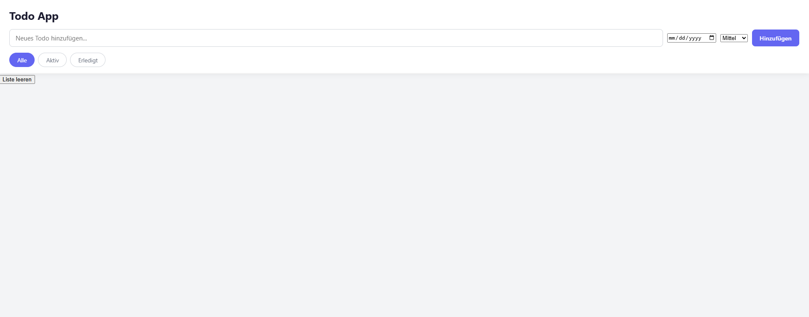
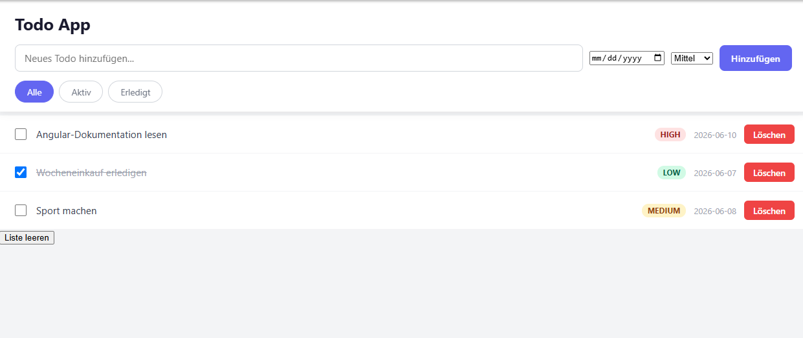
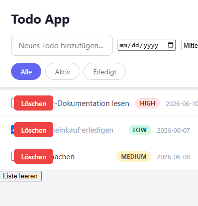
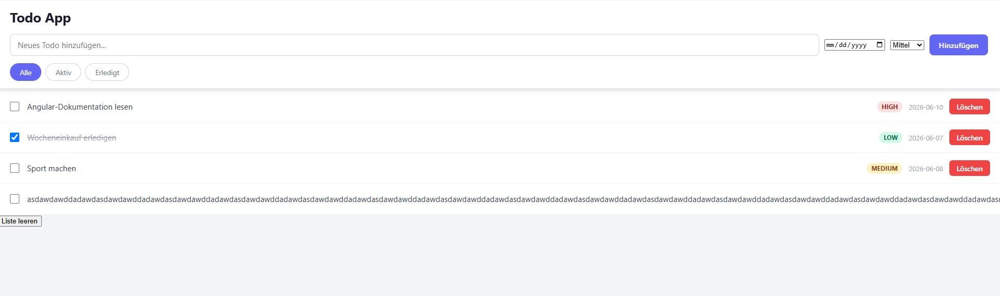
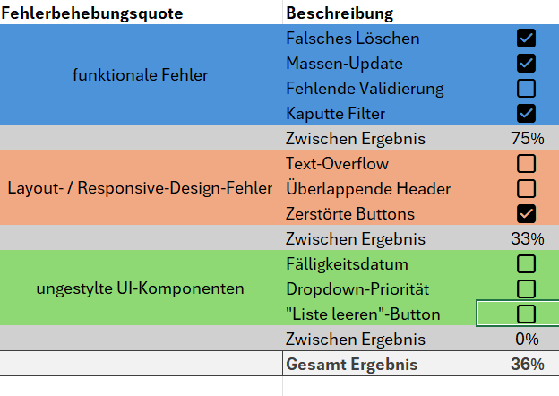
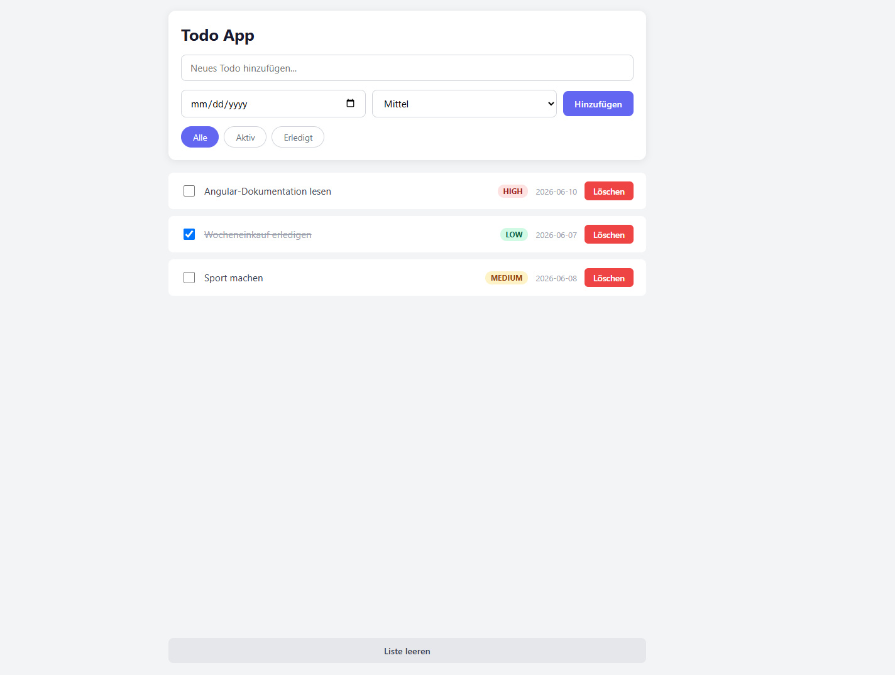
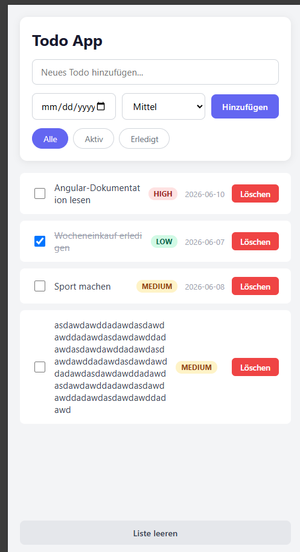
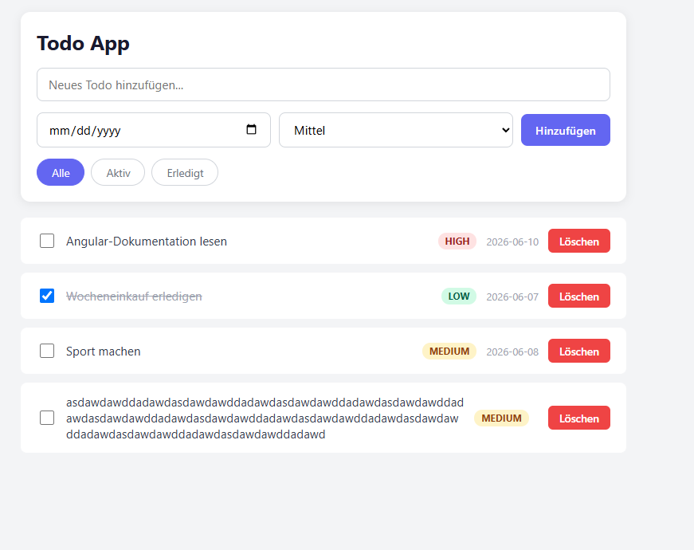
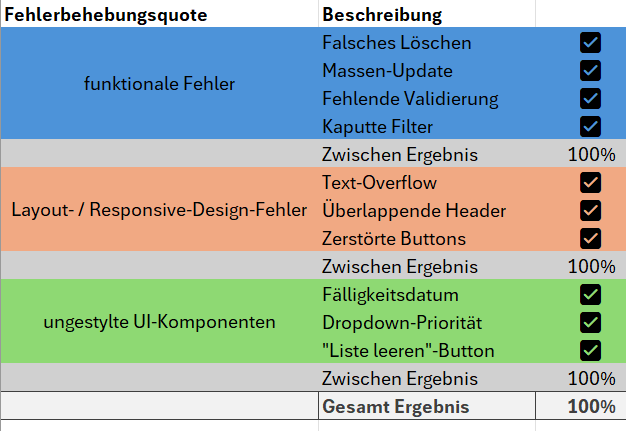
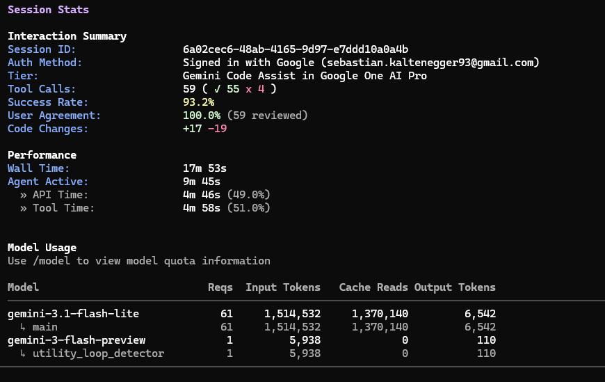

# Workflow 2 – Testdokumentation

## Testbedingungen
Es wurde Gemini Cli mit dem Playwright MCP-Server verwendet zum durchführen. Als Modell kam Gemini 3.1 Flash Lite zum Einsatz. Das Denk-Level wurde auf Medium gesetzt, um einen praxisnahen Kompromiss zwischen Antwortqualität und Geschwindigkeit zu erhalten.

---

## 1. Iteration

### Prompt
Du bist ein Senior Software Engineer. Deine Aufgabe ist es, Fehler in diesem Frontend-Projekt systematisch zu beheben und einen automatisierten Self-Healing-Zyklus durchzuführen.

Dein Fokus:

Logik-/Laufzeitfehler (prüfe hierfür zwingend die Browser-Konsole via Playwright auf Errors/Warnings).

Layout- und Responsive-Fehler.

Unfertige oder unbenutzbare UI-Komponenten.

Dein Workflow:

Analysieren: Nutze den Playwright MCP-Server, um das Frontend zu laden. Inspiziere das DOM und die Konsolen-Ausgaben.

Beheben: Identifiziere die fehlerhaften Dateien im Projekt und nutze deine Dateisystem-Werkzeuge, um präzisen und wartbaren Code zu schreiben.

Verifizieren: Lade die Seite via Playwright neu. Überprüfe, ob der Fehler behoben ist und keine neuen Regressionen (z.B. neue Konsolenfehler) aufgetreten sind.

Wiederhole diesen Zyklus, bis die aktuelle Ansicht fehlerfrei funktioniert.

### Kontext

Kompletter `src/`-Ordner. Ebenfalls wurde der MCP-Server für Playwright installiert.

### Ergebnis

- Zeit bis zur Antwort: **1 Minute 20 Sekunden**
- Gesamtzeit inklusive Implementierung und Test: **1 Minute 20 Sekunden**

---

## 2. Iteration

### Prompt

 > Es gibt immer noch Probleme mit zu langen Texten im Todo. Nicht gestylte Elemente, schlechtes/überlappendes Layout bei kleinem          bildschirm und keine validierung für leeren input. Bitte iteriere weiterhin über die Applikation und behebe alle Probleme

### Anhang

Kompletter `src/`-Ordner. Ebenfalls wurde der MCP-Server für Playwright installiert.

### Ergebnis

- Zeit bis zur Antwort: **45 Sekunden**
- Gesamtzeit inklusive Implementierung und Test: **45 Sekunden**

Man sieht dass das Modell nun eindeutig ein kleineres/responsive Design erstellt hat. Es hat nach und nach die Fehler abgearbeitet und getestet indem es mit Playwright einen Screenshot gemacht hat.

---

## Gesamtergebnis und Schlussfolgerung

Alle identifizierten Fehler konnten letztlich erfolgreich erkannt und behoben werden. Das was ausgebessert wurde und auch geloggt wurde musst im Prinzip nicht kontrolliert werden weil er dies selbst machte und dabei auch den Browser im Vordergrund öffnete.

Es mussten trotz der möglichkeiten den Browser zu nutzen die Fehler genauer angegeben werden, da er diese sonst übersah.

### Tokenverbrauch:

### Gesamtzeit:
ca. 5 Minuten
