# Workflow 3 – Testdokumentation

## Testbedingungen
Zur Analyse des Tokenverbrauchs wurde Google AI Studio verwendet. Als Modell kam Gemini 3.1 Flash Lite zum Einsatz. Das Denk-Level wurde auf Medium gesetzt, um einen praxisnahen Kompromiss zwischen Antwortqualität und Geschwindigkeit zu erhalten.

---

## 1. Iteration

### Prompt
>Du bist ein Senior Software Engineer. Deine Aufgabe ist es, Fehler in diesem Frontend-Projekt systematisch zu beheben. \
>Fokussiere dich auf: \
>Logik-/Laufzeitfehler. \
>Layout- und Responsive-Fehler. \
>Unfertige oder unbenutzbare UI-Komponenten. \
>\
> Sei präzise, effizient und schreibe wartbaren Code.

### Anhang

Kompletter `src/`-Ordner sowie ein Screenshot der ursprünglichen Anwendung. Zu diesem Zeitpunkt wurden noch keine Änderungen am Code vorgenommen und es waren keine TODO-Einträge vorhanden.

### Ergebnis

- Zeit bis zur Antwort: **6,5 Sekunden**
- Gesamtzeit inklusive Implementierung und Test: **4 Minuten 30 Sekunden**

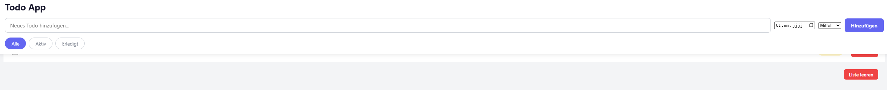

Im Screenshot ist deutlich zu erkennen, dass der Button „Liste leeren“ zwar optisch verbessert wurde, die TODO-Einträge jedoch teilweise hinter dem Header dargestellt werden.

Die Layoutprobleme werden besonders sichtbar, wenn die Bildschirmgröße reduziert wird oder sehr lange Texte verwendet werden.

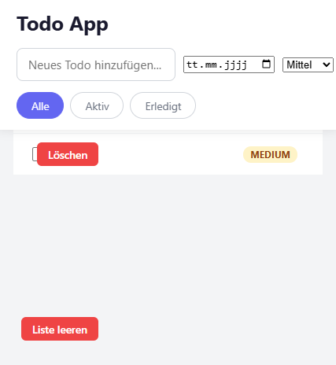
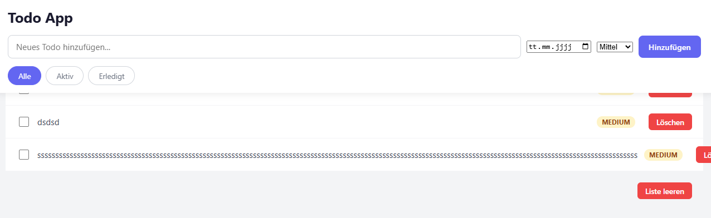

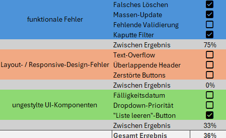

---

## 2. Iteration

### Prompt
>Es gibt immer noch massive Probleme mit dem Layout siehe Bilder im Anhang. Zu dem sind auch manche Elemente nicht gestyled und erst ca. ab den vierten
TODO-Eintrag sieht man diesen.

### Anhang

Kompletter `src/`-Ordner sowie die Screenshots des fehlerhaften Layouts.

### Ergebnis

- Zeit bis zur Antwort: **7,1 Sekunden**
- Gesamtzeit inklusive Implementierung und Test: **6 Minuten 23 Sekunden**

Das Modell konnte die gravierenden Layoutprobleme weitgehend beheben. Die Anwendung ist nun deutlich besser nutzbar. Auch sehr lange Texte führen nicht mehr dazu, dass einzelne Komponenten eines TODO-Eintrags aus dem sichtbaren Bereich verschoben werden.

Der Header überlappt die Inhalte nicht mehr. Allerdings ist bei kleineren Bildschirmgrößen weiterhin ein Teil des ersten TODO-Eintrags abgeschnitten.

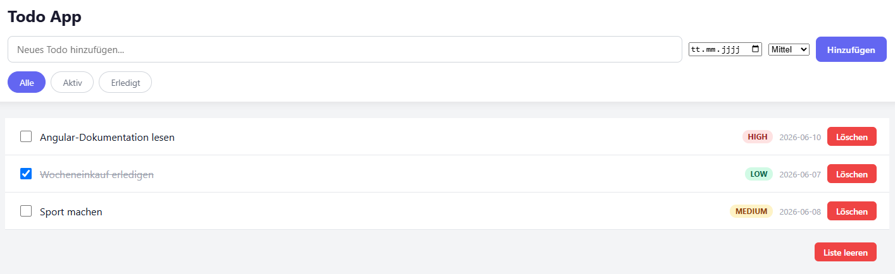
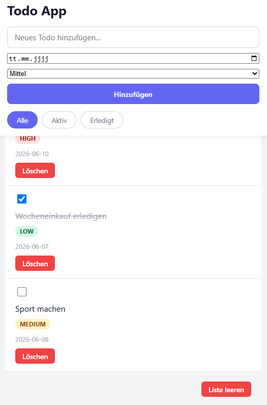
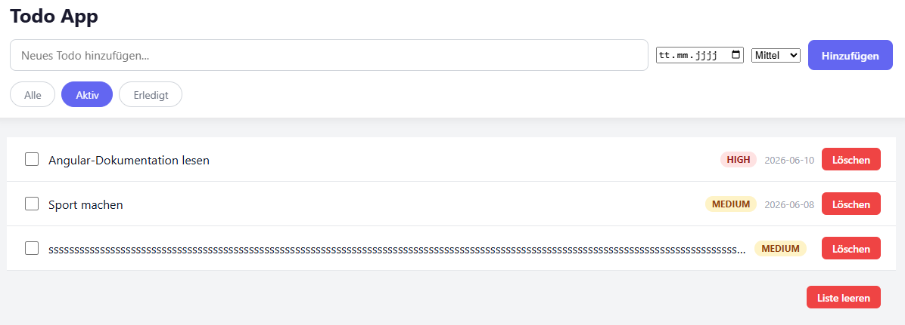

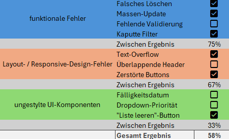

---

## 3. Iteration

### Prompt
>Das sieht jetzt schon viel besser aus. Jedoch wenn der Bildschirm klein wird, dann ist immer noch ein Teil vom ersten TODO abgeschnitten. Zudem ist es möglich TODO's ohne Text oder mit nur Leerzeichen anzulegen! Suche im Code noch nach ungestylten Elementen.

### Anhang

Kompletter `src/`-Ordner sowie ein Screenshot der Anwendung auf einem kleineren Bildschirm.

### Ergebnis

- Zeit bis zur Antwort: **6,1 Sekunden**
- Gesamtzeit inklusive Implementierung und Test: **4 Minuten**

Alle bekannten Fehler sowie die festgestellten UI-Probleme wurden behoben. Damit kann diese Version als finales Ergebnis des Versuchs betrachtet werden.

Zwar wäre es weiterhin möglich, die Abstände zwischen Header und TODO-Liste auf kleinen Bildschirmen weiter zu optimieren, dies lag jedoch außerhalb des Untersuchungsziels dieses Versuchs.

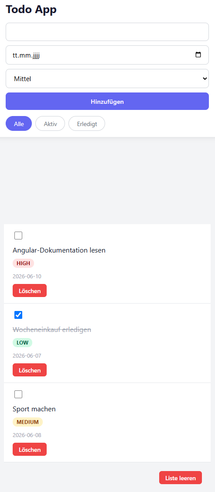

Ebenfalls wird verhindert, dass ein TODO mit einem leeren oder nur aus Leerzeichen bestehenden Titel erstellt wird. 
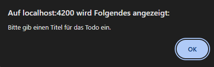

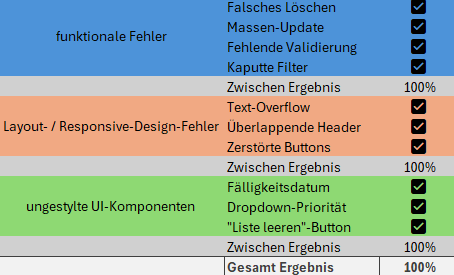

---

## Gesamtergebnis und Schlussfolgerung

Alle identifizierten Fehler konnten letztlich erfolgreich erkannt und behoben werden. Dennoch war ein erheblicher manueller Aufwand erforderlich. Insbesondere das Einfügen der vorgeschlagenen Codeänderungen nahm viel Zeit in Anspruch, da die Antworten häufig nicht eindeutig beschrieben, an welcher Stelle der Code eingefügt werden sollte.

Zusätzlich erwies sich das wiederholte Erstellen von Screenshots sowie das erneute Hochladen derselben Dateien als zeitaufwendig. Ein Vorteil dieses Ansatzes ist jedoch, dass keinerlei zusätzliches Setup benötigt wird und praktisch jeder einen Chat-LLM verwenden kann.

Auffällig war außerdem, dass das Modell viele Design- und Usability-Probleme nicht eigenständig erkannte. Erst durch konkrete Hinweise in den Prompts konnten diese zuverlässig behoben werden. In realen Projekten wären daher vermutlich weitere Iterationen erforderlich, insbesondere wenn die Probleme nicht präzise beschrieben werden.

Positiv hervorzuheben sind die kurzen Antwortzeiten sowie die insgesamt nachvollziehbaren Problembeschreibungen.

### Tokenverbrauch:

| Kategorie | Anzahl |
|------------|---------:|
| Gesamt | 20.625 |
| Input | 15.784 |
| Output | 4.877 |

### Gesamtzeit:
ca. 15 Minuten
